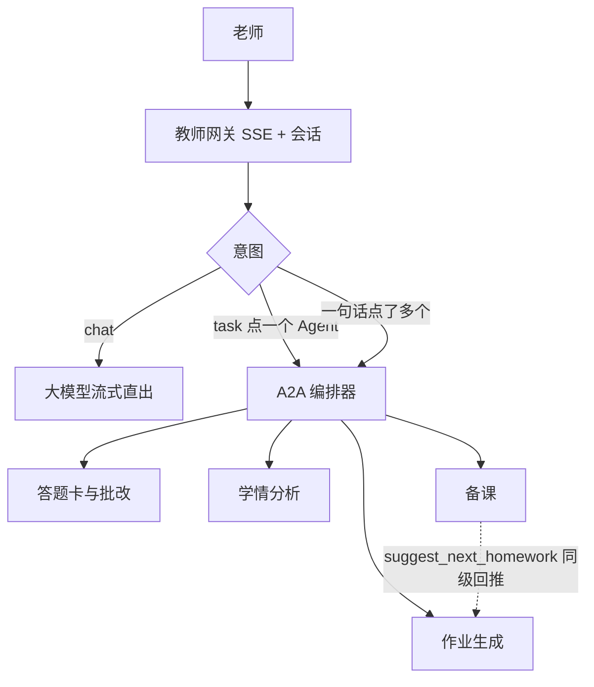

# 作业批改多智能体

面向高中单科老师的作业批改与教学闭环。四个业务 Agent 同级，经 A2A 协作；工具经 MCP 调用。账本 MySQL，热数据 Redis，向量 FAISS。

运行时数据在 `data/`（名单、试卷、扫描件等），已从版本库忽略。密钥只放本地 `.env`，仓库只保留 `.env.example`。

需求文档：[实施规格](docs/作业批改多智能体-实施规格.md)、[前端交互规划](docs/前端交互规划.md)。
教师端是 Streamlit 八页壳（对话 / 名单 / 试卷 / 答题卡 / 批改 / 确认队列 / 学情 / 备课）+ 顶栏班级作业阶段 + 每页底栏同一条 `ask`。最小宽度 1280，绑定 127.0.0.1。

## 目录

```
src/zypg/     网关、Agent、MCP 工具、教师端 UI
tests/        pytest
samples/      示例名单与试卷
sql/          MySQL 初始化
docs/         实施规格与前端规划
tools/edupaper-mcp/  本地 edupaper-mcp 依赖声明
data/         运行时文件（不入库）
```

## 启动

### 1. 依赖服务

```bash
docker compose up -d
```

等待 MySQL / Redis 健康（约半分钟）。`sql/schema.sql` 会在 MySQL 首次初始化时执行。

### 2. 配置

```bash
copy .env.example .env   # Windows
# cp .env.example .env  # macOS / Linux
```

填写：

- `LLM_API_KEY` / `LLM_BASE_URL` / `LLM_MODEL`：OpenAI 兼容接口（如阿里云百炼业务空间 `.../compatible-mode/v1`）
- `OCR_URL=https://mineru.net/api/v4` 与 `MINERU_TOKEN`：主观题切块 OCR（MinerU 精准解析）
- 作业排版：对接 [edupaper-mcp](https://www.mcpworld.com/zh/detail/8b4b49676f2fdcfa9d414a76d175a128)（`npx -y edupaper-mcp` 的 `generate_exam_paper`）。需要本机 Node.js/`npx`。不是打开 mcpworld 网页。仅 pytest 或 `EDUPAPER_MCP_MOCK=1` 才用本地 mock。可选 `EDUPAPER_MCP_URL` 走 HTTP JSON-RPC。

本机默认绑定 `127.0.0.1:8765`，不要对公网开放。

`docker-compose.yml` 把 MySQL 映射到 **3307**、Redis 映射到 **6380**（镜像为 `mysql:8.0.43` 与 `redis:7.2`）。`.env.example` 已按这两个端口填写。本机 3306/6379 空闲时，可把映射和 `.env` 一起改回默认端口。

### 3. 安装

Python 3.11+，以及 Node.js（作业排版调用 edupaper-mcp）。

```bash
pip install -r requirements.txt
pip install -e .
cd tools/edupaper-mcp
npm install
```

网关会优先用 `tools/edupaper-mcp/node_modules/edupaper-mcp`；没有本地包时再 `npx -y edupaper-mcp`。

### 4. 启动网关

```bash
python -m zypg
```

另开终端启动教师操作台：

```bash
python -m zypg ui
```

浏览器打开 `http://127.0.0.1:8501`。首次进入先导入名单；顶栏有班级 / 作业 / 阶段；左侧八项导航；底栏对话全局可发送。页面按钮与输入框走同一 `/ask/stream`。

## 对话调用（不是流水线）

四个业务 Agent **同级**。老师在 `http://127.0.0.1:8501` 对话里点谁就调谁；系统不会自动按出题→出卡→批改→学情往下跑。只有一句话里同时点了多个 Agent（例如「出这份作业并出卡」）才按点名顺序派发。



对话示例（每句只派一个 Agent，顺序可任意）：

1. `导入示例名单`（门禁，不是业务 Agent）
2. `导入示例试卷` 或 `按等差数列出题` → 作业生成
3. `只出卡` → 答题卡与批改（到此为止，不会接着批改）
4. `用刚出的卡当扫描件批改` 或附上扫描 PNG 说 `批改` → 仍是答题卡与批改
5. `看看这班学情` → 学情分析（不必先出卡）
6. `备课提纲` / `下一份作业` → 备课（后者经 A2A 回推作业生成）
7. `什么是等差数列` → 闲聊，不派 Agent

`samples/roster.example.csv` 为 3 人名单；`samples/paper.example.md` 为 2 客观 + 1 主观。未导入名单时业务口令会被拒绝。

## 测试

```bash
pytest -q
```

必须通过：`test_roster_gate`、`test_intent`、`test_a2a_peer`、`test_omr_pixels`、`test_grade_queue`、`test_insight`、`test_mysql_schema`。

## 协议

- `GET /health` `POST /roster/import` `POST /ask` `GET /ask/stream` `POST /a2a` `POST /mcp` `GET /.well-known/agent-card.json` `GET /insights/{class_id}`
- MCP `tools/list` 与 `src/zypg/protocol/catalog.py` 一致
- A2A：`message/send`、`tasks/get`、`tasks/cancel`

## 已知限制

- 主路径是答题卡扫描件，不处理潦草练习本。
- 客观题只认气泡像素，不走 OCR/LLM。
- 主观题 LLM 只给建议分，未确认不写入长期 `mastery_events`。
- 无 LLM Key 时聊天返回「未配置」；出题请改用导入试卷；主观题全部进确认队列。
- 作业排版生产走 edupaper-mcp stdio（`npx -y edupaper-mcp`），失败不会悄悄改用 python-docx。pytest 使用同名工具 mock。
- 画像只有知识点会 / 弱 / 未测。
